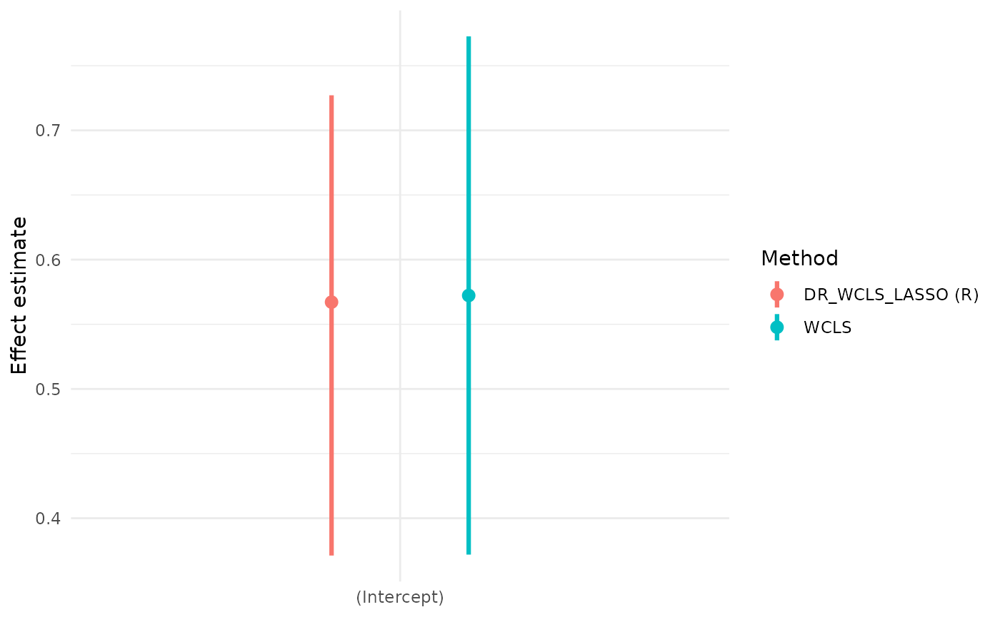
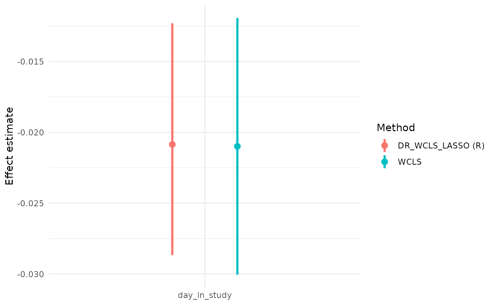
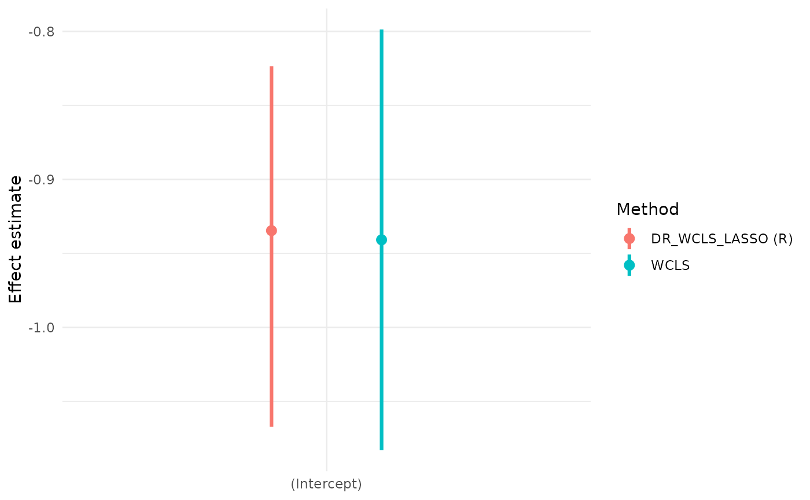
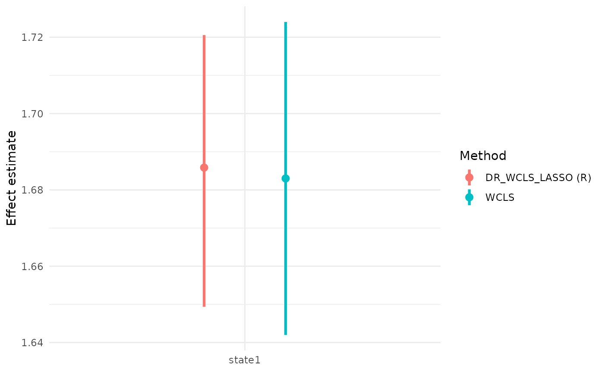
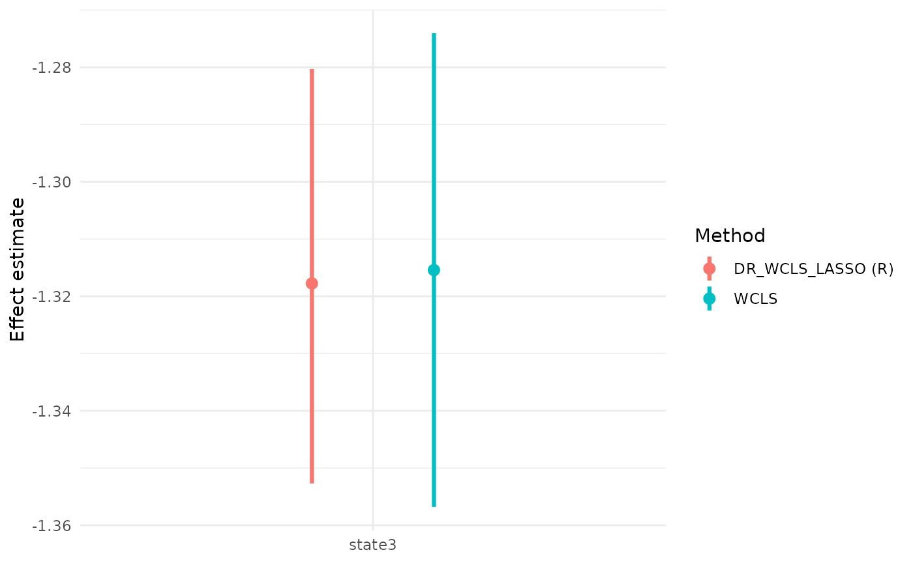
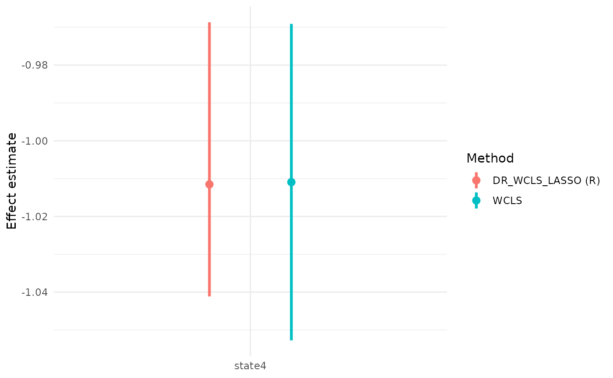

# MRTpostInfLASSO

## Introduction

Micro-randomized trials (MRTs) are designed to evaluate the
effectiveness of mobile health (mHealth) interventions delivered via
smartphones. In practice, the assumptions required for MRTs are often
difficult to satisfy: randomization probabilities can be uncertain,
observations are frequently incomplete, and prespecifying features from
high-dimensional contexts for linear working models is also challenging.
To address these issues, the **doubly robust weighted centered least
squares (DR-WCLS)** framework provides a flexible procedure for variable
selection and inference. The methods incorporates supervised learning
algorithms and enables valid inference on time-varying causal effects in
longitudinal settings.

This vignette introduces the **MRTpostInfLASSO** package. Its core
function, **DR_WCLS_LASSO**, allows users to perform variable selection,
estimate time-varying causal effects and make valid inferences
conditional on the selected variables.

Individual-level data of an MRT can be summarized as \\\left\\O_1, A_1,
O_2, A_2, \cdots, O_T, A_T, O\_{T+1} \right\\\\ where \\T\\ is the total
decision times, \\O_t\\ is the information collected between \\t-1\\ and
\\t\\, and \\A_t\\ is the treatment provided at time \\t\\. Here we
consider treatment \\A_t \in \left\\0,1\right\\\\. Treatment options are
intended to influence a proximal outcome \\Y\_{t+1} \in O\_{t+1}\\.

Denote history \\H_t = \left\\ O_1, A_1, O_2, A_2, \cdots, A\_{t-1}, O_t
\right\\\\ and randomized probabilities \\\mathbf{p} = \left\\p_t(A_t
\mid H_t) \right\\\_{t=1}^T\\. The DR-WCLS criterion is given by

\\ \mathbb{P}\_n \Bigl\[ \sum\_{t=1}^{T} \tilde{\sigma}^2_t(S_t)\\
\Bigl( \frac{W_t(A_t-\tilde{p}\_t(1 \mid S_t))
(Y\_{t+1}-g_t(H_t,A_t))}{\tilde{\sigma}^2_t(S_t)}\\
+\beta(t;H_t)-f_t(S_t)^T \beta\Bigr)\\ f_t(S_t) \Bigr\] = 0 \\

where \\\beta(t;H_t) := g_t(H_t,1) - g_t(H_t,0)\\ is the causal
excursion effect under the fully observed history \\H_t\\, and
\\\tilde{\sigma}^2_t(S_t) := \tilde{p}\_t(1 \mid S_t)(1-\tilde{p}\_t(1
\mid S_t))\\.

The \\\hat{\beta}\_n^{(DR)}\\ is a consistent estimator of the true
\\\beta\\ if either the randomization probability \\p_t(A_t \mid H_t)\\
or the conditional expectation \\g_t(H_t, A_t)\\ is correctly specified.

The **DR_WCLS** algorithm is as follows:

Step I: Randomly split the \\n\\ individuals into \\K\\ equal folds
\\\left\\I_k\right\\^K\_{k=1}\\ assuming \\n\\ is a multiple of \\K\\.
Let \\I^∁\_k\\ denote the complement of fold k.

Step II: For each fold \\k\\, use data from \\I^∁\_k\\ to estimate the
nuisance functions \\\hat{g}^{(k)}\_t(H_t,A_t)\\,\\\hat{p}^{(k)}\_t(1
\mid H_t)\\, \\\hat{\tilde{p}}^{(k)}\_t(1 \mid S_t)\\, and compute the
weight \\\hat{W}\_t^{(k)} = \hat{\tilde{p}}^{(k)}\_t(1 \mid S_t) /
\hat{p}^{(k)}\_t(1 \mid H_t)\\.

Step III: For each \\j \in I_k\\ and time \\t\\, construct the
pseudo-outcome \\\tilde{Y}\_{t+1}^{(DR)}\\ as follows, then regress it
on \\f_t(S_t)^T \beta\\ using weights \\\tilde{p}\_t^{(k)}(1 \mid
S_t)(1-\tilde{p}\_t^{(k)}(1 \mid S_t))\\.

\\ \tilde{Y}^{(DR)}\_{t+1,j} :=
\frac{\hat{W}\_{t,j}^{(k)}(A\_{t,j}-\hat{\tilde{p}}\_t^{(k)}(1 \mid
S\_{t,j}))
(Y\_{t+1,j}-\hat{g}\_t^{(k)}(H\_{t,j},A\_{t,j}))}{\hat{\tilde{p}}\_t^{(k)}(1
\mid S\_{t,j})(1-\hat{\tilde{p}}\_t^{(k)}(1 \mid S\_{t,j}))} \\ + \Bigl(
\hat{g}\_t^{(k)}(H\_{t,j},1) - \hat{g}\_t^{(k)}(H\_{t,j},0) \Bigr) \\

To conduct variable selection, **DR_WCLS_LASSO** solves the problem

\\ \min\_{\beta} \frac{1}{n} \sum\_{i=1}^{n}\sum\_{t=1}^{T} \Bigl\[
\hat{\tilde{p}}^{(k)}\_{t}(1 \mid S_t)\\
\bigl(1-\hat{\tilde{p}}^{(k)}\_{t}(1 \mid S_t)\bigr)\\
\bigl(\tilde{Y}^{(DR)}\_{t+1,i}-f_t(S_t)^{\top}\beta\bigr)^2 \Bigr\] +
\lambda \lVert \beta \rVert\_{1} - w^{\top}\beta, \\

where \\\lambda\\ is the LASSO regularization parameter, \\\omega\\ is
the noise vector.

After the variable selection procedure, we conduct post-selection
inference using DR-WCLS conditional on the selected variables. This
provides estimates for the selected variables along with their
corresponding confidence intervals.

\\ \min\_{\beta} \frac{1}{n} \sum\_{i=1}^{n}\sum\_{t=1}^{T} \Bigl\[
\hat{\tilde{p}}^{(k)}\_{t}(1 \mid S_t)\\
\bigl(1-\hat{\tilde{p}}^{(k)}\_{t}(1 \mid S_t)\bigr)\\
\bigl(\tilde{Y}^{(DR)}\_{t+1,i}-f_t(S_t)^{\top}\beta_E\bigr)^2 \Bigr\]
\\

## Installation

The package can be installed from our GitHub repository.

``` r
# Install From GitHub
# remotes::install_github("WHD-Lab/DR_WCLS_LASSO")
```

### Loading the Package

``` r
library(MRTpostInfLASSO)
```

## Real Data Example

### HeartSteps

We illustrate the functions in the MRTpostInfLASSO package using the
`HeartSteps` dataset from the MRTAnalysis package. We demonstrate how to
generate the pseudo-outcome, perform variable selection, and conduct
valid post-selection inference.

HeartSteps is a mobile health intervention designed to encourage
physical activity by delivering tailored suggestions. The dataset comes
from a 6-week micro-randomized trial involving 37 participants.
Participants were randomized at 5 decision points per day and received
2-5 notificaitons daily. The dataset contains 7,770 records, with 5
observations per day for each participants. Each record includes the
decision point, whether a notification was sent, participant
availability for walking, and 30-minute step counts before and after the
decision point.

To begin, we load the `HeartSteps` data using the following code. A
summary of `data_mimicHeartSteps` is as follows:

``` r
# Load HeartSteps Data
library(MRTAnalysis)
data(data_mimicHeartSteps)
head(data_mimicHeartSteps)
#>   userid decision_point day_in_study logstep_30min logstep_30min_lag1
#> 1      1              1            0     2.3902011          0.0000000
#> 2      1              2            0    -0.6931472          2.3902011
#> 3      1              3            0     2.4646823         -0.6931472
#> 4      1              4            0     0.1206936          2.4646823
#> 5      1              5            0     0.8322060          0.1206936
#> 6      1              6            1     1.8450452          0.8322060
#>   logstep_pre30min is_at_home_or_work intervention rand_prob avail
#> 1       -0.6931472                  1            0       0.6     0
#> 2        2.1962380                  1            0       0.6     1
#> 3        4.5894007                  1            1       0.6     1
#> 4        3.1791124                  1            1       0.6     1
#> 5        3.2945170                  0            0       0.6     0
#> 6        4.6658254                  1            0       0.6     0
```

We first specify the variable names for the participant ID,
history\\H_t\\, moderator\\S_t\\, treatment\\A_t\\, proximal
outcome\\Y_t\\, and randomization probability\\p_t\\.

``` r
set.seed(100)
ID = 'userid'
Ht = c('logstep_30min_lag1','logstep_pre30min','is_at_home_or_work', 'day_in_study')
St = c('logstep_30min_lag1','logstep_pre30min','is_at_home_or_work', 'day_in_study')
At = 'intervention'
outcome = 'logstep_30min'
prob = 'rand_prob'
```

#### Generating Pseudo-outcome

To generate the pseudo-outcome, we provide three methods for estimating
the nuisance functions: LASSO, random forest and gradient boosting.

\\ \tilde{Y}^{(DR)}\_{t+1,j} :=
\frac{\hat{W}\_{t,j}^{(k)}(A\_{t,j}-\hat{\tilde{p}}\_t^{(k)}(1 \mid
S\_{t,j}))
(Y\_{t+1,j}-\hat{g}\_t^{(k)}(H\_{t,j},A\_{t,j}))}{\hat{\tilde{p}}\_t^{(k)}(1
\mid S\_{t,j})(1-\hat{\tilde{p}}\_t^{(k)}(1 \mid S\_{t,j}))} \\ + \Bigl(
\hat{g}\_t^{(k)}(H\_{t,j},1) - \hat{g}\_t^{(k)}(H\_{t,j},0) \Bigr) \\

We illustrate their use use via the functions
`pseudo_outcome_generator_CVlasso`, `pseudo_outcome_generator_rf_v2`,
and `pseudo_outcome_generator_gbm`.

``` r
pseudo_outcome_CVlasso = pseudo_outcome_generator_CVlasso(fold = 5,ID = ID,
                                                     data = data_mimicHeartSteps, 
                                                     Ht = Ht, St = St, At = At, 
                                                     prob = prob, outcome = outcome,
                                                     core_num = 1)
#> Loading required package: parallel

pseudo_outcome_RF = pseudo_outcome_generator_rf_v2(fold = 5,ID = ID,
                                                   data = data_mimicHeartSteps, 
                                                   Ht = Ht, St = St, At = At, 
                                                   prob = prob, outcome = outcome,
                                                   core_num = 1)


pseudo_outcome_GBM = pseudo_outcome_generator_gbm(fold = 5,ID = ID,
                                                  data = data_mimicHeartSteps, 
                                                  Ht = Ht, St = St, At = At, 
                                                  prob = prob, outcome = outcome,
                                                  core_num = 1)
```

#### Variable Selection

To perform variable selection, **DR_WCLS_LASSO** solves the problem

\\ \min\_{\beta} \frac{1}{n} \sum\_{i=1}^{n}\sum\_{t=1}^{T} \Bigl\[
\hat{\tilde{p}}^{(k)}\_{t}(1 \mid S_t)\\
\bigl(1-\hat{\tilde{p}}^{(k)}\_{t}(1 \mid S_t)\bigr)\\
\bigl(\tilde{Y}^{(DR)}\_{t+1,i}-f_t(S_t)^{\top}\beta\bigr)^2 \Bigr\] +
\lambda \lVert \beta \rVert\_{1} - w^{\top}\beta \\

Variable selection is performed using the
`variable_selection_PY_penal_int` or `FISTA_backtracking` function. We
first define `my_formula`, specifying the outcome and candidate
variables. Below, we demonstrate the use of both functions.

Python version

``` r
my_formula = as.formula(paste("yDR ~", paste(c("logstep_30min_lag1", "logstep_pre30min",
                                      "is_at_home_or_work", "day_in_study"),
                                       collapse = " + ")))
# 
# set.seed(100)
# var_selection_python = variable_selection_PY_penal_int(data = pseudo_outcome_CVlasso,ID,
#                                                        my_formula,
#                                                        lam = NULL, noise_scale = NULL,
#                                                        splitrat = 0.8,
#                                                        # virtualenv_path = "fakepath/wcls",
#                                                        ridge_term = 0, beta = NULL)
# 
# cat('The selected variable list:',var_selection_python$E)
```

R version

``` r
set.seed(100)
var_selection_R = FISTA_backtracking(data = pseudo_outcome_CVlasso, ID, my_formula,
                  lam = NULL, noise_scale = NULL,splitrat = 0.8,
                  max_ite = 10^(5), tol = 10^(-4), beta = NULL)
var_selection_R$E
#> [1] "(Intercept)"  "day_in_study"

cat('The selected variable list:',var_selection_R$E)
#> The selected variable list: (Intercept) day_in_study
```

#### Post-selection Inference

After variable selection, we conduct post-selection inference using
DR-WCLS, conditioning on the selected variables. This yields GEE
coefficient estimates and corresponding confidence intervals.

\\ \min\_{\beta} \frac{1}{n} \sum\_{i=1}^{n}\sum\_{t=1}^{T} \Bigl\[
\hat{\tilde{p}}^{(k)}\_{t}(1 \mid S_t)\\
\bigl(1-\hat{\tilde{p}}^{(k)}\_{t}(1 \mid S_t)\bigr)\\
\bigl(\tilde{Y}^{(DR)}\_{t+1,i}-f_t(S_t)^{\top}\beta_E\bigr)^2 \Bigr\]
\\

`DR_WCLS_LASSO` is used for post-selection inference. The input of the
function are the data for inference, number of folds, and variable names
for ID, time, \\H_t\\, \\S_t\\, \\A_t\\, \\Y_t\\ and randomization
probability. `method_pseu` specifies the method used for pseudo-outcome
generation (e.g., “CVLASSO”, “RandomForest”, “GradientBoosting”).
`varSelect_program` indicates the variable selection programming
language.

``` r
# set.seed(123)

# reticulate::py_run_string("
# import random
# import numpy as np
# 
# random.seed(123)
# np.random.seed(123)
# ")

# UI_return_python = DR_WCLS_LASSO(data = data_mimicHeartSteps,
#                           fold = 5, ID = ID,
#                           time = "decision_point",
#                           Ht = Ht, St = St, At = At,
#                           prob = prob, outcome = outcome,
#                           # virtualenv_path = 'fakepath/wcls',
#                           method_pseu = "CVLASSO",
#                           varSelect_program = "Python",
#                           standardize_x = F, standardize_y = F)
# 
# UI_return_python
```

``` r
set.seed(100)

UI_return_R = DR_WCLS_LASSO(data = data_mimicHeartSteps,
                          fold = 5, ID = ID,
                          time = "decision_point",
                          Ht = Ht, St = St, At = At,
                          prob = prob, outcome = outcome,
                          method_pseu = "CVLASSO", 
                          varSelect_program = "R",
                          standardize_x = F, standardize_y = F)
#> [1] "remove 0 lines of data due to NA produced for yDR"
#> [1] "The current lambda value is: 130.875622692401"
#> [1] "select predictors: (Intercept)"  "select predictors: day_in_study"
#> [1] FALSE
#> [1] "logstep_30min_lag1" "logstep_pre30min"   "is_at_home_or_work"
#> Loading required package: dplyr
#> 
#> Attaching package: 'dplyr'
#> The following objects are masked from 'package:stats':
#> 
#>     filter, lag
#> The following objects are masked from 'package:base':
#> 
#>     intersect, setdiff, setequal, union
UI_return_R
#>              E     GEE_est      lowCI     upperCI   prop_low   prop_up
#> 1  (Intercept)  0.56779396  0.3716397  0.72776335 0.05044121 0.9499924
#> 2 day_in_study -0.02085767 -0.0286707 -0.01230142 0.04944023 0.9504154
#>         pvalue
#> 1 1.249038e-06
#> 2 1.641057e-04
```

#### A Comparison of Using Randomized LASSO and Weighted Centered Least Squares

Select variables using randomized LASSO

``` r
library(selectiveInference)
#> Loading required package: glmnet
#> Loading required package: Matrix
#> Loaded glmnet 4.1-10
#> Loading required package: intervals
#> 
#> Attaching package: 'intervals'
#> The following object is masked from 'package:Matrix':
#> 
#>     expand
#> Loading required package: survival
#> Loading required package: adaptMCMC
#> Loading required package: coda
#> Loading required package: MASS
#> 
#> Attaching package: 'MASS'
#> The following object is masked from 'package:dplyr':
#> 
#>     select
res_randomizedLASSO = randomizedLasso(X = as.matrix(data_mimicHeartSteps[,St]), 
                y = as.matrix(data_mimicHeartSteps[,outcome]), 
                lam = 100000, 
                family="gaussian",
                noise_scale=NULL, 
                ridge_term=NULL, 
                max_iter=100,       
                kkt_tol=1.e-4,      
                parameter_tol=1.e-8,
                objective_tol=1.e-8,
                objective_stop=FALSE,
                kkt_stop=TRUE,
                parameter_stop=TRUE)

St[res_randomizedLASSO$active_set]
#> [1] "day_in_study"
```

Make inference using weighted centered least squares

``` r


wcls_fit = wcls(
  data = data_mimicHeartSteps,
  id = 'userid', 
  outcome = 'logstep_30min', 
  treatment = 'intervention', 
  rand_prob = 0.5, 
  moderator_formula= ~ day_in_study,
  control_formula = ~logstep_30min_lag1 + logstep_pre30min + day_in_study,
  availability = NULL,
  numerator_prob = NULL,
  verbose = TRUE
)
#> availability = NULL: defaulting availability to always available.
#> Constant randomization probability 0.5 is used.
#> Constant numerator probability 0.5 is used.

wcls_res = summary(wcls_fit)
wcls_res$causal_excursion_effect
#>                Estimate     95% LCL    95% UCL      StdErr Hotelling df1 df2
#> (Intercept)   0.5722731  0.37187918  0.7726669 0.098255727  33.92273   1  31
#> day_in_study -0.0209880 -0.03004471 -0.0119313 0.004440621  22.33854   1  31
#>                   p-value
#> (Intercept)  2.024579e-06
#> day_in_study 4.698739e-05

# UI_return_python
UI_return_R
#>              E     GEE_est      lowCI     upperCI   prop_low   prop_up
#> 1  (Intercept)  0.56779396  0.3716397  0.72776335 0.05044121 0.9499924
#> 2 day_in_study -0.02085767 -0.0286707 -0.01230142 0.04944023 0.9504154
#>         pvalue
#> 1 1.249038e-06
#> 2 1.641057e-04
```



#### Arguments in DR_WCLS_LASSO

The pseudo outcome generation method can be specified using the
`method_pseu` argument. Currently, three options are supported: CVLASSO,
RandomForest, and GradientBoosting. The default is CVLASSO.

``` r
set.seed(100)

UI_return_method_pseu = DR_WCLS_LASSO(data = data_mimicHeartSteps,
                                 fold = 5, ID = ID,
                                 time = "decision_point",
                                 Ht = Ht, St = St, At = At,
                                 prob = prob, outcome = outcome,
                                 # virtualenv_path = 'fakepath/wcls',
                                 method_pseu = "CVLASSO",
                                 varSelect_program = "R",
                                 standardize_x = F, standardize_y = F)
#> [1] "remove 0 lines of data due to NA produced for yDR"
#> [1] "The current lambda value is: 130.874430913628"
#> [1] "select predictors: (Intercept)"  "select predictors: day_in_study"
#> [1] FALSE
#> [1] "logstep_30min_lag1" "logstep_pre30min"   "is_at_home_or_work"

UI_return_method_pseu
#>              E     GEE_est       lowCI     upperCI   prop_low   prop_up
#> 1  (Intercept)  0.56844965  0.37212341  0.72853390 0.05039441 0.9500313
#> 2 day_in_study -0.02089795 -0.02872757 -0.01232027 0.04913065 0.9506675
#>         pvalue
#> 1 1.217928e-06
#> 2 1.595093e-04
```

The LASSO penalty can be adjusted by setting ‘lam’ in the
`DR_WCLS_LASSO` function.

``` r
set.seed(100)

UI_return_lambda = DR_WCLS_LASSO(data = data_mimicHeartSteps,
                                 fold = 5, ID = ID,
                                 time = "decision_point",
                                 Ht = Ht, St = St, At = At,
                                 prob = prob, outcome = outcome,
                                 # virtualenv_path = 'fakepath/wcls',
                                 method_pseu = "CVLASSO",
                                 varSelect_program = "R",
                                 lam = 100,
                                 standardize_x = F, standardize_y = F)
#> [1] "remove 0 lines of data due to NA produced for yDR"
#> [1] "The current lambda value is: 100"
#> [1] "select predictors: (Intercept)"  "select predictors: day_in_study"
#> [1] FALSE
#> [1] "logstep_30min_lag1" "logstep_pre30min"   "is_at_home_or_work"

UI_return_lambda
#>              E     GEE_est       lowCI     upperCI   prop_low   prop_up
#> 1  (Intercept)  0.56913165  0.37408863  0.72926844 0.05002324 0.9492241
#> 2 day_in_study -0.02092669 -0.02871173 -0.01239679 0.04924098 0.9500773
#>         pvalue
#> 1 9.928750e-07
#> 2 1.354456e-04
```

The data split rate in Step 1 of the DR_WCLS algorithm can be set using
‘splitrat’ in the `DR_WCLS_LASSO` function.

``` r
set.seed(100)
UI_return_splitrat = DR_WCLS_LASSO(data = data_mimicHeartSteps, 
                                   fold = 5, ID = ID, 
                                   time = "decision_point", 
                                   Ht = Ht, St = St, At = At, 
                                   prob = prob, outcome = outcome,
                                   method_pseu = "CVLASSO", 
                                   varSelect_program = "R",
                                   splitrat = 0.8,
                                   standardize_x = F, standardize_y = F)
#> [1] "remove 0 lines of data due to NA produced for yDR"
#> [1] "The current lambda value is: 130.874723988392"
#> [1] "select predictors: (Intercept)"  "select predictors: day_in_study"
#> [1] FALSE
#> [1] "logstep_30min_lag1" "logstep_pre30min"   "is_at_home_or_work"
UI_return_splitrat
#>              E    GEE_est       lowCI     upperCI   prop_low   prop_up
#> 1  (Intercept)  0.5681533  0.37196098  0.72816041 0.05043564 0.9499928
#> 2 day_in_study -0.0208761 -0.02869056 -0.01231765 0.04939291 0.9504397
#>         pvalue
#> 1 1.229547e-06
#> 2 1.615734e-04
```

#### Analysis Using Manually Created Interaction Terms

Interaction terms can be manually created and included in the \\H_t\\
and \\S_t\\ variable lists. In this example, we create an indicator for
whether the time in the study is over 14 days and include its
interactions with `logstep_30min_lag1`, `logstep_pre30min`, and
`is_at_home_or_work`.

``` r
data_mimicHeartSteps$timeover14 = as.numeric(data_mimicHeartSteps$decision_point>14)
data_mimicHeartSteps$int_lag1_timeover14 = data_mimicHeartSteps$logstep_30min_lag1 * data_mimicHeartSteps$timeover14

data_mimicHeartSteps$int_pre30_timeover14 = data_mimicHeartSteps$logstep_pre30min * data_mimicHeartSteps$timeover14

data_mimicHeartSteps$int_home_timeover14 = data_mimicHeartSteps$is_at_home_or_work * data_mimicHeartSteps$timeover14
```

We add the interaction terms in the \\H_t\\ and \\S_t\\ variable lists
and rerun the procedure.

``` r
set.seed(200)
ID = 'userid'
Ht_int = c('logstep_30min_lag1','logstep_pre30min','is_at_home_or_work', 'timeover14',
       'int_lag1_timeover14', 'int_pre30_timeover14', 'int_home_timeover14','day_in_study')
St_int = c('logstep_30min_lag1','logstep_pre30min','is_at_home_or_work', 'timeover14',
       'int_lag1_timeover14', 'int_pre30_timeover14', 'int_home_timeover14','day_in_study')
At = 'intervention'
outcome = 'logstep_30min'
prob = 'rand_prob'


# UI_return_int_python = DR_WCLS_LASSO(data = data_mimicHeartSteps, 
#                           fold = 5, ID = ID, 
#                           time = "decision_point", Ht = Ht_int, St = St_int, 
#                           At = At, prob = prob, outcome = outcome,
#                           # virtualenv_path = 'fakepath/wcls',
#                           method_pseu = "CVLASSO", 
#                           varSelect_program = "Python",
#                           standardize_x = F, standardize_y = F)
# 
# UI_return_int_python
```

``` r
UI_return_int_R = DR_WCLS_LASSO(data = data_mimicHeartSteps, 
                          fold = 5, ID = ID, 
                          time = "decision_point", Ht = Ht_int, St = St_int, 
                          At = At, prob = prob, outcome = outcome,
                          # virtualenv_path = 'fakepath/wcls',
                          method_pseu = "CVLASSO", 
                          varSelect_program = "R",
                          standardize_x = F, standardize_y = F)
#> [1] "remove 0 lines of data due to NA produced for yDR"
#> [1] "The current lambda value is: 152.858404333928"
#> [1] "select predictors: (Intercept)"       
#> [2] "select predictors: logstep_30min_lag1"
#> [3] "select predictors: logstep_pre30min"  
#> [4] "select predictors: day_in_study"      
#> [1] FALSE
#> [1] "is_at_home_or_work"   "timeover14"           "int_lag1_timeover14" 
#> [4] "int_pre30_timeover14" "int_home_timeover14"

UI_return_int_R
#>                    E      GEE_est       lowCI     upperCI   prop_low   prop_up
#> 1        (Intercept)  0.567524285 -0.47444120  0.66217094 0.04924123 0.9504657
#> 2 logstep_30min_lag1 -0.002280636 -0.04139731  0.12778499 0.05028444 0.9498846
#> 3   logstep_pre30min -0.001329584 -0.01784046  0.14310874 0.04958894 0.9492032
#> 4       day_in_study -0.020471589 -0.02903725 -0.01115698 0.04997574 0.9491035
#>       pvalue
#> 1 0.66162061
#> 2 0.62371553
#> 3 0.25826528
#> 4 0.00215414
```

### Intern Health Study

IHS is a micro-randomized trial involving 859 medical interns. The aim
of the study is to investigate how mHealth interventions affect
participants’ weekly mood, physical activity, and sleep. Each day,
participants had a 0.5 probability of receiving a tailored message. The
dataset includes a range of variables collected from wearable devices.

``` r
df_IHS = read.csv('~/Desktop/25Winter/IHS Design/Hyperparameter/dfEventsThreeMonthsTimezones.csv')
df_IHS$prob = rep(0.5, length(df_IHS$PARTICIPANTIDENTIFIER))
df_IHS$less27 = (df_IHS$Age < 27)

ID = 'PARTICIPANTIDENTIFIER'

# Ht = c('StepsPastDay', 'is_weekend', 'maxHRPast24Hours', 'HoursSinceLastMood')
# St = c('StepsPastDay', 'is_weekend', 'maxHRPast24Hours',  'HoursSinceLastMood')
Ht = c('StepsPastDay', 'is_weekend', 'maxHRPast24Hours', 'HoursSinceLastMood','less27', "Sex", "has_child","StepsPastWeek",'PHQ10above0','exercisedPast24Hours')
St = c('StepsPastDay', 'is_weekend', 'maxHRPast24Hours',  'HoursSinceLastMood', 'less27', "Sex", "has_child",'StepsPastWeek','PHQ10above0','exercisedPast24Hours')
At = 'sent'
outcome = 'LogStepsReward'
prob = 'prob'

set.seed(99)

df_IHS_cleaned = na.omit(df_IHS)

# UI_return_IHS_python = DR_WCLS_LASSO(data = df_IHS_cleaned,
#                           fold = 5, ID = ID,
#                           time = "time", Ht = Ht, St = St, At = At,
#                           prob = prob, outcome = outcome,
#                           # virtualenv_path = 'fakepath/wcls',
#                           method_pseu = "CVLASSO", lam = 55,
#                           noise_scale = NULL, splitrat = 0.8,
#                           level = 0.9, core_num=3, CI_algorithm = 'lapply',
#                           max_iterate = 10^{6}, max_tol = 10^{-3}, varSelect_program = "Python",
#                           standardize_x =  T, standardize_y = T)
# 
# UI_return_IHS_python
```

``` r
set.seed(100)
UI_return_IHS_R = DR_WCLS_LASSO(data = df_IHS_cleaned,
                          fold = 5, ID = ID,
                          time = "time", Ht = Ht, St = St, At = At,
                          prob = prob, outcome = outcome,
                          # virtualenv_path = 'fakepath/wcls',
                          method_pseu = "CVLASSO", lam = 30,
                          noise_scale = NULL, splitrat = 0.8,
                          level = 0.9, core_num=3, CI_algorithm = 'lapply',
                          max_iterate = 10^{6}, max_tol = 10^{-3}, varSelect_program = "R",
                          standardize_x =  T, standardize_y = T)

UI_return_IHS_R
```

### Simulated Data

We also illustrate the use of the package with a simulated dataset and
demonstrate why DR_WCLS is needed, rather than using randomized LASSO
for selection and WCLS for inference.

``` r
sim_data = generate_dataset(N = 1000, T = 40, P = 50, 
                            sigma_residual = 1.5, sigma_randint = 1.5, 
                            main_rand = 3, rho = 0.7,
                            beta_logit = c(-1, 1.6 * rep(1/50, 50)), 
                            model = ~ state1 + state2 + state3 + state4,
                            beta = matrix(c(-1, 1.7, 1.5, -1.3, -1),ncol = 1),
                            theta1 = 0.8)

Ht = unlist(lapply(1:50, FUN = function(X) paste0("state",X)))
St = unlist(lapply(1:25, FUN = function(X) paste0("state",X)))


UI_return_sim_R = DR_WCLS_LASSO(data = sim_data,
                                fold = 5, ID = "id",
                                time = "decision_point",
                                Ht = Ht, St = St, At = "action",
                                prob = "prob", outcome = "outcome",
                                method_pseu = "CVLASSO",
                                varSelect_program = "R",
                                standardize_x = F, standardize_y = F,
                                beta = matrix(c(-1, 1.7, 1.5, -1.3, -1, rep(0, 21))))
#> [1] "remove 0 lines of data due to NA produced for yDR"
#> [1] "The current lambda value is: 442.789879628912"
#> [1] "select predictors: (Intercept)" "select predictors: state1"     
#> [3] "select predictors: state2"      "select predictors: state3"     
#> [5] "select predictors: state4"     
#> [1] FALSE
#>  [1] "state5"  "state6"  "state7"  "state8"  "state9"  "state10" "state11"
#>  [8] "state12" "state13" "state14" "state15" "state16" "state17" "state18"
#> [15] "state19" "state20" "state21" "state22" "state23" "state24" "state25"
```

``` r
sim_randomizedLASSO = randomizedLasso(X = as.matrix(sim_data[,St]), 
                y = as.matrix(sim_data[,'outcome']), 
                lam = 225000, 
                family="gaussian",
                noise_scale=NULL, 
                ridge_term=NULL, 
                max_iter=100,       
                kkt_tol=1.e-4,      
                parameter_tol=1.e-8,
                objective_tol=1.e-8,
                objective_stop=FALSE,
                kkt_stop=TRUE,
                parameter_stop=TRUE)

St[sim_randomizedLASSO$active_set]
#> [1] "state1"  "state4"  "state21"
```

``` r
mod_formula = as.formula(paste("~", paste0("state", 1:25, collapse = " + ")))

ctrl_formula = as.formula(paste("~", paste0("state", 1:50, collapse = " + ")))

wcls_args = list(
  data      = sim_data,
  id        = "id",
  outcome   = "outcome",
  treatment = "action",
  rand_prob = "prob",
  moderator_formula = mod_formula,
  control_formula   = ctrl_formula,
  availability      = NULL,
  numerator_prob    = NULL,
  verbose           = TRUE
)

wcls_sim_fit = do.call(wcls, wcls_args)
#> availability = NULL: defaulting availability to always available.
#> Constant numerator probability 0.5 is used.

wcls_sim_res = summary(wcls_sim_fit)
wcls_sim_res$causal_excursion_effect
#>                  Estimate      95% LCL      95% UCL     StdErr         Wald df1
#> (Intercept) -0.9408247779 -1.082945386 -0.798704169 0.07241676 1.687871e+02   1
#> state1       1.6829978826  1.641992789  1.724002977 0.02089392 6.488248e+03   1
#> state2       1.4843603066  1.440355738  1.528364875 0.02242228 4.382471e+03   1
#> state3      -1.3154198626 -1.356797086 -1.274042639 0.02108353 3.892620e+03   1
#> state4      -1.0109323970 -1.052759556 -0.969105238 0.02131279 2.249901e+03   1
#> state5       0.0305012642 -0.010904231  0.071906760 0.02109794 2.090045e+00   1
#> state6      -0.0025985423 -0.045321684  0.040124599 0.02176934 1.424850e-02   1
#> state7      -0.0415874398 -0.084648318  0.001473438 0.02194143 3.592481e+00   1
#> state8      -0.0223120651 -0.064569614  0.019945484 0.02153210 1.073759e+00   1
#> state9       0.0173490645 -0.025645530  0.060343659 0.02190766 6.271340e-01   1
#> state10     -0.0115301052 -0.054094818  0.031034607 0.02168861 2.826201e-01   1
#> state11     -0.0147671843 -0.056895612  0.027361243 0.02146630 4.732393e-01   1
#> state12     -0.0169723743 -0.057589554  0.023644806 0.02069626 6.725144e-01   1
#> state13      0.0005474569 -0.042535311  0.043630224 0.02195258 6.219114e-04   1
#> state14      0.0196327944 -0.022303754  0.061569343 0.02136853 8.441406e-01   1
#> state15      0.0191755020 -0.023003753  0.061354757 0.02149220 7.960340e-01   1
#> state16      0.0103907303 -0.031395382  0.052176842 0.02129188 2.381574e-01   1
#> state17      0.0095253458 -0.031466473  0.050517165 0.02088715 2.079711e-01   1
#> state18     -0.0289704803 -0.069679416  0.011738456 0.02074301 1.950598e+00   1
#> state19     -0.0017142918 -0.043412598  0.039984014 0.02124714 6.509814e-03   1
#> state20     -0.0313087192 -0.074311184  0.011693745 0.02191167 2.041643e+00   1
#> state21     -0.0501772980 -0.091727229 -0.008627367 0.02117153 5.617070e+00   1
#> state22      0.0383980022 -0.001557773  0.078353777 0.02035924 3.557083e+00   1
#> state23     -0.0132016082 -0.056211974  0.029808758 0.02191569 3.628635e-01   1
#> state24      0.0144528696 -0.027110810  0.056016550 0.02117854 4.657106e-01   1
#> state25      0.0231727510 -0.020279437  0.066624939 0.02214082 1.095388e+00   1
#>             df2    p-value
#> (Intercept) 923 0.00000000
#> state1      923 0.00000000
#> state2      923 0.00000000
#> state3      923 0.00000000
#> state4      923 0.00000000
#> state5      923 0.14860115
#> state6      923 0.90501051
#> state7      923 0.05835372
#> state8      923 0.30036930
#> state9      923 0.42861202
#> state10     923 0.59511695
#> state11     923 0.49167354
#> state12     923 0.41238807
#> state13     923 0.98010969
#> state14     923 0.35845527
#> state15     923 0.37251434
#> state16     923 0.62565600
#> state17     923 0.64846956
#> state18     923 0.16285814
#> state19     923 0.93571121
#> state20     923 0.15338257
#> state21     923 0.01799109
#> state22     923 0.05960560
#> state23     923 0.54706814
#> state24     923 0.49513838
#> state25     923 0.29555457
```


