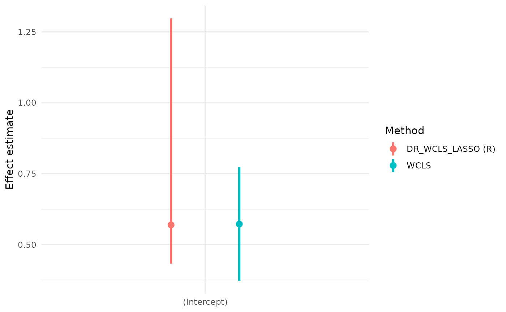
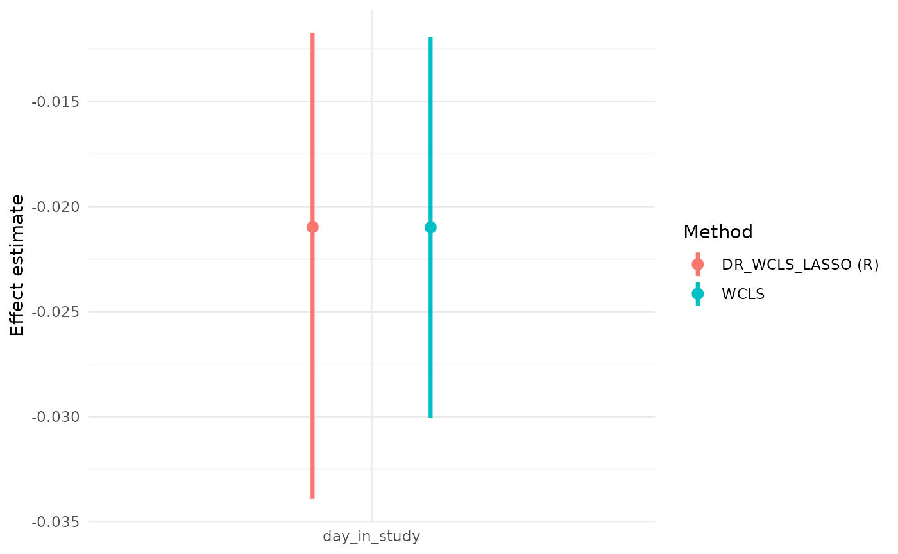
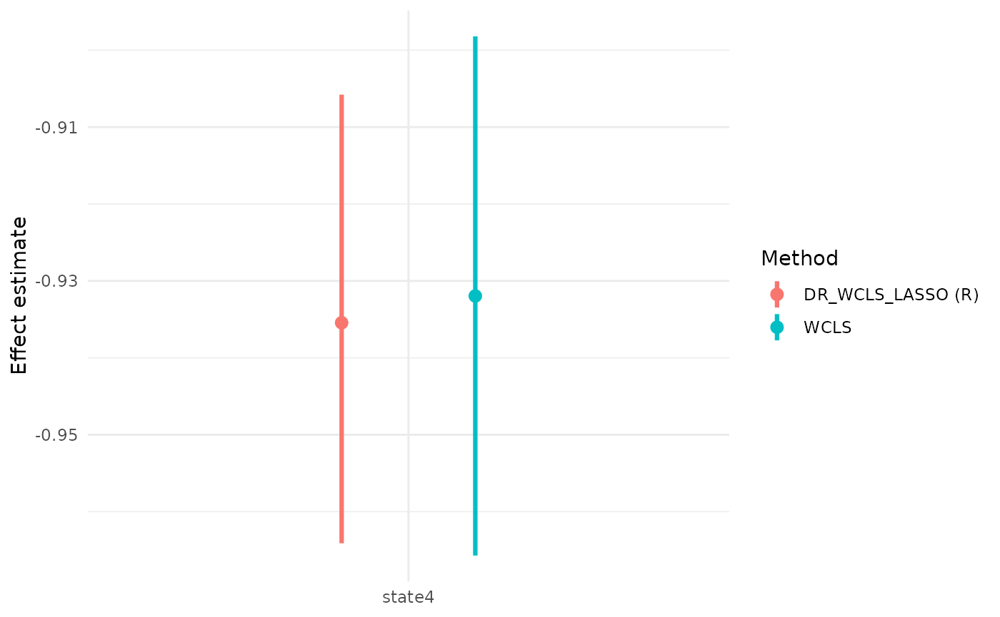

# MRTpostInfLASSO

## Introduction

Micro-randomized trials (MRTs) are designed to evaluate the
effectiveness of mobile health (mHealth) interventions delivered via
smartphones. In practice, the assumptions required for MRTs are often
difficult to satisfy: randomization probabilities can be uncertain,
observations are frequently incomplete, and prespecifying features from
high-dimensional contexts for linear working models is also challenging.
To address these issues, the **doubly robust weighted centered least
squares (DR-WCLS)** framework provides a flexible procedure for variable
selection and inference. The methods incorporates supervised learning
algorithms and enables valid inference on time-varying causal effects in
longitudinal settings.

This vignette introduces the **MRTpostInfLASSO** package. Its core
function, **DR_WCLS_LASSO**, allows users to perform variable selection,
estimate time-varying causal effects and make valid inferences
conditional on the selected variables.

Individual-level data of an MRT can be summarized as \\\left\\O_1, A_1,
O_2, A_2, \cdots, O_T, A_T, O\_{T+1} \right\\\\ where \\T\\ is the total
decision times, \\O_t\\ is the information collected between \\t-1\\ and
\\t\\, and \\A_t\\ is the treatment provided at time \\t\\. Here we
consider treatment \\A_t \in \left\\0,1\right\\\\. Treatment options are
intended to influence a proximal outcome \\Y\_{t+1} \in O\_{t+1}\\.

Denote history \\H_t = \left\\ O_1, A_1, O_2, A_2, \cdots, A\_{t-1}, O_t
\right\\\\ and randomized probabilities \\\mathbf{p} = \left\\p_t(A_t
\mid H_t) \right\\\_{t=1}^T\\. The DR-WCLS criterion is given by

\\ \mathbb{P}\_n \Bigl\[ \sum\_{t=1}^{T} \tilde{\sigma}^2_t(S_t)\\
\Bigl( \frac{W_t(A_t-\tilde{p}\_t(1 \mid S_t))
(Y\_{t+1}-g_t(H_t,A_t))}{\tilde{\sigma}^2_t(S_t)}\\
+\beta(t;H_t)-f_t(S_t)^T \beta\Bigr)\\ f_t(S_t) \Bigr\] = 0 \\

where \\\beta(t;H_t) := g_t(H_t,1) - g_t(H_t,0)\\ is the causal
excursion effect under the fully observed history \\H_t\\, and
\\\tilde{\sigma}^2_t(S_t) := \tilde{p}\_t(1 \mid S_t)(1-\tilde{p}\_t(1
\mid S_t))\\.

The \\\hat{\beta}\_n^{(DR)}\\ is a consistent estimator of the true
\\\beta\\ if either the randomization probability \\p_t(A_t \mid H_t)\\
or the conditional expectation \\g_t(H_t, A_t)\\ is correctly specified.

The **DR_WCLS** algorithm is as follows:

Step I: Randomly split the \\n\\ individuals into \\K\\ equal folds
\\\left\\I_k\right\\^K\_{k=1}\\ assuming \\n\\ is a multiple of \\K\\.
Let \\I^∁\_k\\ denote the complement of fold k.

Step II: For each fold \\k\\, use data from \\I^∁\_k\\ to estimate the
nuisance functions \\\hat{g}^{(k)}\_t(H_t,A_t)\\,\\\hat{p}^{(k)}\_t(1
\mid H_t)\\, \\\hat{\tilde{p}}^{(k)}\_t(1 \mid S_t)\\, and compute the
weight \\\hat{W}\_t^{(k)} = \hat{\tilde{p}}^{(k)}\_t(1 \mid S_t) /
\hat{p}^{(k)}\_t(1 \mid H_t)\\.

Step III: For each \\j \in I_k\\ and time \\t\\, construct the
pseudo-outcome \\\tilde{Y}\_{t+1}^{(DR)}\\ as follows, then regress it
on \\f_t(S_t)^T \beta\\ using weights \\\tilde{p}\_t^{(k)}(1 \mid
S_t)(1-\tilde{p}\_t^{(k)}(1 \mid S_t))\\.

\\ \tilde{Y}^{(DR)}\_{t+1,j} :=
\frac{\hat{W}\_{t,j}^{(k)}(A\_{t,j}-\hat{\tilde{p}}\_t^{(k)}(1 \mid
S\_{t,j}))
(Y\_{t+1,j}-\hat{g}\_t^{(k)}(H\_{t,j},A\_{t,j}))}{\hat{\tilde{p}}\_t^{(k)}(1
\mid S\_{t,j})(1-\hat{\tilde{p}}\_t^{(k)}(1 \mid S\_{t,j}))} \\ + \Bigl(
\hat{g}\_t^{(k)}(H\_{t,j},1) - \hat{g}\_t^{(k)}(H\_{t,j},0) \Bigr) \\

To conduct variable selection, **DR_WCLS_LASSO** solves the problem

\\ \min\_{\beta} \frac{1}{n} \sum\_{i=1}^{n}\sum\_{t=1}^{T} \Bigl\[
\hat{\tilde{p}}^{(k)}\_{t}(1 \mid S_t)\\
\bigl(1-\hat{\tilde{p}}^{(k)}\_{t}(1 \mid S_t)\bigr)\\
\bigl(\tilde{Y}^{(DR)}\_{t+1,i}-f_t(S_t)^{\top}\beta\bigr)^2 \Bigr\] +
\lambda \lVert \beta \rVert\_{1} - w^{\top}\beta, \\

where \\\lambda\\ is the LASSO regularization parameter, \\\omega\\ is
the noise vector.

After the variable selection procedure, we conduct post-selection
inference using DR-WCLS conditional on the selected variables. This
provides estimates for the selected variables along with their
corresponding confidence intervals.

\\ \min\_{\beta} \frac{1}{n} \sum\_{i=1}^{n}\sum\_{t=1}^{T} \Bigl\[
\hat{\tilde{p}}^{(k)}\_{t}(1 \mid S_t)\\
\bigl(1-\hat{\tilde{p}}^{(k)}\_{t}(1 \mid S_t)\bigr)\\
\bigl(\tilde{Y}^{(DR)}\_{t+1,i}-f_t(S_t)^{\top}\beta_E\bigr)^2 \Bigr\]
\\

## Installation

The package can be installed from our GitHub repository.

``` r
# Install From GitHub
# remotes::install_github("WHD-Lab/DR_WCLS_LASSO")
```

### Loading the Package

``` r
library(MRTpostInfLASSO)
```

### Set-up

To configure a Python virtual environment in R, please run the following
code:

``` r

# Configure virtual environment
venv_info = venv_config()
#> Installing pyenv ...
#> Done! pyenv has been installed to '/home/runner/.local/share/r-reticulate/pyenv/bin/pyenv'.
#> + /home/runner/.local/share/r-reticulate/pyenv/bin/pyenv update
#> + /home/runner/.local/share/r-reticulate/pyenv/bin/pyenv install --skip-existing 3.9.25
#> Using Python: /home/runner/.pyenv/versions/3.9.25/bin/python3.9
#> Creating virtual environment 'a9c268bc' ...
#> + /home/runner/.pyenv/versions/3.9.25/bin/python3.9 -m venv /home/runner/.virtualenvs/a9c268bc
#> Done!
#> Installing packages: pip, wheel, setuptools
#> + /home/runner/.virtualenvs/a9c268bc/bin/python -m pip install --upgrade pip wheel setuptools
#> Installing packages: numpy
#> + /home/runner/.virtualenvs/a9c268bc/bin/python -m pip install --upgrade --no-user numpy
#> Virtual environment 'a9c268bc' successfully created.
#> Using virtual environment 'a9c268bc' ...
#> + /home/runner/.virtualenvs/a9c268bc/bin/python -m pip install --upgrade --no-user 'cython>=0.18' 'numpy>=1.7.1' 'scipy>=0.16.0' 'joblib>=0.15.1'
#> Using virtual environment 'a9c268bc' ...
#> + /home/runner/.virtualenvs/a9c268bc/bin/python -m pip install --upgrade --no-user 'numpy==1.22.4'
#> Using virtual environment 'a9c268bc' ...
#> + /home/runner/.virtualenvs/a9c268bc/bin/python -m pip install --upgrade --no-user --no-build-isolation 'git+https://github.com/regreg/regreg.git'
#> Using virtual environment 'a9c268bc' ...
#> + /home/runner/.virtualenvs/a9c268bc/bin/python -m pip install --upgrade --no-user scikit-learn nose
#> Using virtual environment 'a9c268bc' ...
#> + /home/runner/.virtualenvs/a9c268bc/bin/python -m pip install --upgrade --no-user --no-build-isolation /tmp/RtmpLZNqJZ/selective-inference-1f5a3433f66c
#> Using virtual environment 'a9c268bc' ...
#> + /home/runner/.virtualenvs/a9c268bc/bin/python -m pip install --upgrade --no-user pandas mpmath
venv = venv_info$hash
print(venv)
#> [1] "a9c268bc"
# [1] "a9c268bc"

# Do the python deps load?
library(reticulate)
np = import("numpy", convert = FALSE)
lasso_mod = import("selectinf.randomized.lasso", convert = FALSE)$lasso
```

Or, if already configured, use

``` r
library(reticulate)
venv = "a9c268bc"
use_virtualenv(venv, required = TRUE)
np = import("numpy", convert = FALSE)
lassopy = import("selectinf.randomized.lasso", convert = FALSE)$lasso
selected_targets = import("selectinf.base", convert = FALSE)$selected_targets  
const = lassopy$gaussian
exact_grid_inference = import("selectinf.randomized.exact_reference", convert = FALSE)$exact_grid_inference  
```

## Real Data Example

### HeartSteps

We illustrate the functions in the MRTpostInfLASSO package using the
`HeartSteps` dataset from the MRTAnalysis package. We demonstrate how to
generate the pseudo-outcome, perform variable selection, and conduct
valid post-selection inference.

HeartSteps is a mobile health intervention designed to encourage
physical activity by delivering tailored suggestions. The dataset comes
from a 6-week micro-randomized trial involving 37 participants.
Participants were randomized at 5 decision points per day and received
2-5 notificaitons daily. The dataset contains 7,770 records, with 5
observations per day for each participants. Each record includes the
decision point, whether a notification was sent, participant
availability for walking, and 30-minute step counts before and after the
decision point.

To begin, we load the `HeartSteps` data using the following code. A
summary of `data_mimicHeartSteps` is as follows:

``` r
# Load HeartSteps Data
library(MRTAnalysis)
data(data_mimicHeartSteps)
head(data_mimicHeartSteps)
#>   userid decision_point day_in_study logstep_30min logstep_30min_lag1
#> 1      1              1            0     2.3902011          0.0000000
#> 2      1              2            0    -0.6931472          2.3902011
#> 3      1              3            0     2.4646823         -0.6931472
#> 4      1              4            0     0.1206936          2.4646823
#> 5      1              5            0     0.8322060          0.1206936
#> 6      1              6            1     1.8450452          0.8322060
#>   logstep_pre30min is_at_home_or_work intervention rand_prob avail
#> 1       -0.6931472                  1            0       0.6     0
#> 2        2.1962380                  1            0       0.6     1
#> 3        4.5894007                  1            1       0.6     1
#> 4        3.1791124                  1            1       0.6     1
#> 5        3.2945170                  0            0       0.6     0
#> 6        4.6658254                  1            0       0.6     0
```

We first specify the variable names for the participant ID,
history\\H_t\\, moderator\\S_t\\, treatment\\A_t\\, proximal
outcome\\Y_t\\, and randomization probability\\p_t\\.

``` r
set.seed(100)
ID = 'userid'
Ht = c('logstep_30min_lag1','logstep_pre30min','is_at_home_or_work', 'day_in_study')
St = c('logstep_30min_lag1','logstep_pre30min','is_at_home_or_work', 'day_in_study')
At = 'intervention'
outcome = 'logstep_30min'
prob = 'rand_prob'
```

#### Generating Pseudo-outcome

To generate the pseudo-outcome, we provide three methods for estimating
the nuisance functions: LASSO, random forest and gradient boosting.

\\ \tilde{Y}^{(DR)}\_{t+1,j} :=
\frac{\hat{W}\_{t,j}^{(k)}(A\_{t,j}-\hat{\tilde{p}}\_t^{(k)}(1 \mid
S\_{t,j}))
(Y\_{t+1,j}-\hat{g}\_t^{(k)}(H\_{t,j},A\_{t,j}))}{\hat{\tilde{p}}\_t^{(k)}(1
\mid S\_{t,j})(1-\hat{\tilde{p}}\_t^{(k)}(1 \mid S\_{t,j}))} \\ + \Bigl(
\hat{g}\_t^{(k)}(H\_{t,j},1) - \hat{g}\_t^{(k)}(H\_{t,j},0) \Bigr) \\

We illustrate their use use via the functions
`pseudo_outcome_generator_CVlasso`, `pseudo_outcome_generator_rf_v2`,
and `pseudo_outcome_generator_gbm`.

``` r
pseudo_outcome_CVlasso = pseudo_outcome_generator_CVlasso(fold = 5,ID = ID,
                                                     data = data_mimicHeartSteps, 
                                                     Ht = Ht, St = St, At = At, 
                                                     prob = prob, outcome = outcome,
                                                     core_num = 1)
#> Loading required package: parallel

pseudo_outcome_RF = pseudo_outcome_generator_rf_v2(fold = 5,ID = ID,
                                                   data = data_mimicHeartSteps, 
                                                   Ht = Ht, St = St, At = At, 
                                                   prob = prob, outcome = outcome,
                                                   core_num = 1)


pseudo_outcome_GBM = pseudo_outcome_generator_gbm(fold = 5,ID = ID,
                                                  data = data_mimicHeartSteps, 
                                                  Ht = Ht, St = St, At = At, 
                                                  prob = prob, outcome = outcome,
                                                  core_num = 1)
```

#### Variable Selection

To perform variable selection, **DR_WCLS_LASSO** solves the problem

\\ \min\_{\beta} \frac{1}{n} \sum\_{i=1}^{n}\sum\_{t=1}^{T} \Bigl\[
\hat{\tilde{p}}^{(k)}\_{t}(1 \mid S_t)\\
\bigl(1-\hat{\tilde{p}}^{(k)}\_{t}(1 \mid S_t)\bigr)\\
\bigl(\tilde{Y}^{(DR)}\_{t+1,i}-f_t(S_t)^{\top}\beta\bigr)^2 \Bigr\] +
\lambda \lVert \beta \rVert\_{1} - w^{\top}\beta \\

Variable selection is performed using the
`variable_selection_PY_penal_int` or `FISTA_backtracking` function. We
first define `my_formula`, specifying the outcome and candidate
variables. Below, we demonstrate the use of both functions.

Python version

``` r
my_formula = as.formula(paste("yDR ~", paste(c("logstep_30min_lag1", "logstep_pre30min",
                                      "is_at_home_or_work", "day_in_study"),
                                       collapse = " + ")))

set.seed(100)
var_selection_python = variable_selection_PY(data = pseudo_outcome_CVlasso,ID,
                                             my_formula,
                                             lam = NULL, noise_scale = NULL,
                                             venv = venv,
                                             splitrat = 0.8,
                                             beta = NULL)

cat('The selected variable list:',var_selection_python$E)
#> The selected variable list: (Intercept) day_in_study
```

R version

``` r
set.seed(100)
var_selection_R = FISTA_backtracking(data = pseudo_outcome_CVlasso, ID, my_formula,
                  lam = NULL, noise_scale = NULL,splitrat = 0.8,
                  max_ite = 10^(5), tol = 10^(-4), beta = NULL)
var_selection_R$E
#> [1] "(Intercept)"  "day_in_study"

cat('The selected variable list:',var_selection_R$E)
#> The selected variable list: (Intercept) day_in_study
```

#### Post-selection Inference

After variable selection, we conduct post-selection inference using
DR-WCLS, conditioning on the selected variables. This yields GEE
coefficient estimates and corresponding confidence intervals.

\\ \min\_{\beta} \frac{1}{n} \sum\_{i=1}^{n}\sum\_{t=1}^{T} \Bigl\[
\hat{\tilde{p}}^{(k)}\_{t}(1 \mid S_t)\\
\bigl(1-\hat{\tilde{p}}^{(k)}\_{t}(1 \mid S_t)\bigr)\\
\bigl(\tilde{Y}^{(DR)}\_{t+1,i}-f_t(S_t)^{\top}\beta_E\bigr)^2 \Bigr\]
\\

`DR_WCLS_LASSO` is used for post-selection inference. The input of the
function are the data for inference, number of folds, and variable names
for ID, time, \\H_t\\, \\S_t\\, \\A_t\\, \\Y_t\\ and randomization
probability. `method_pseu` specifies the method used for pseudo-outcome
generation (e.g., “CVLASSO”, “RandomForest”, “GradientBoosting”).
`varSelect_program` indicates the variable selection programming
language.

``` r
# set.seed(123)

# reticulate::py_run_string("
#   import random
#   import numpy as np
#   random.seed(123)
#   np.random.seed(123)
# ")

UI_return_python = DR_WCLS_LASSO(data = data_mimicHeartSteps,
                          fold = 5, ID = ID,
                          time = "decision_point",
                          Ht = Ht, St = St, At = At,
                          prob = prob, outcome = outcome,
                          venv = venv,
                          method_pseu = "CVLASSO",
                          varSelect_program = "Python",
                          standardize_x = F, standardize_y = F)
#> [1] "remove 0 lines of data due to NA produced for yDR"
#> [1] "The current lambda value is: 185.075931263644"
#> [1] "select predictors: (Intercept)"       
#> [2] "select predictors: logstep_30min_lag1"
#> [3] "select predictors: logstep_pre30min"  
#> [4] "select predictors: day_in_study"      
#> [1] FALSE
#> [1] "is_at_home_or_work"
#> Loading required package: dplyr
#> 
#> Attaching package: 'dplyr'
#> The following objects are masked from 'package:stats':
#> 
#>     filter, lag
#> The following objects are masked from 'package:base':
#> 
#>     intersect, setdiff, setequal, union
UI_return_python
#>                    E       GEE_est       lowCI     upperCI   prop_low   prop_up
#> 1        (Intercept)  0.5708024959  0.33889936  0.81385795 0.04959088 0.9500275
#> 2 logstep_30min_lag1 -0.0018185733 -0.04364098  0.03981320 0.05008837 0.9507713
#> 3   logstep_pre30min  0.0003347885 -0.04281442  0.03394711 0.04964602 0.9499208
#> 4       day_in_study -0.0208486824 -0.02947561 -0.01277935 0.04986123 0.9491411
#>         pvalue
#> 1 5.027927e-05
#> 2 9.532547e-01
#> 3 9.417171e-01
#> 4 2.167085e-05
```

``` r
set.seed(123)

UI_return_R = DR_WCLS_LASSO(data = data_mimicHeartSteps,
                          fold = 5, ID = ID,
                          time = "decision_point",
                          Ht = Ht, St = St, At = At,
                          prob = prob, outcome = outcome,
                          method_pseu = "CVLASSO", 
                          varSelect_program = "R",
                          standardize_x = F, standardize_y = F)
#> [1] "remove 0 lines of data due to NA produced for yDR"
#> [1] "The current lambda value is: 130.890748071636"
#> [1] "select predictors: (Intercept)"       
#> [2] "select predictors: logstep_30min_lag1"
#> [3] "select predictors: day_in_study"      
#> [1] FALSE
#> [1] "logstep_pre30min"   "is_at_home_or_work"
UI_return_R
#>                    E     GEE_est      lowCI     upperCI   prop_low   prop_up
#> 1        (Intercept)  0.56822858  0.4307585  1.29312966 0.04948184 0.9493800
#> 2 logstep_30min_lag1 -0.00115191 -0.3080987 -0.02007353 0.05021225 0.9499908
#> 3       day_in_study -0.02083829 -0.0471477 -0.01262934 0.05038607 0.9506433
#>         pvalue
#> 1 0.0003264524
#> 2 0.0472959799
#> 3 0.0008664515
```

#### A Comparison of Using Randomized LASSO and Weighted Centered Least Squares

Select variables using randomized LASSO

``` r

library(selectiveInference)
#> Loading required package: glmnet
#> Loading required package: Matrix
#> Loaded glmnet 4.1-10
#> Loading required package: intervals
#> 
#> Attaching package: 'intervals'
#> The following object is masked from 'package:Matrix':
#> 
#>     expand
#> Loading required package: survival
#> Loading required package: adaptMCMC
#> Loading required package: coda
#> Loading required package: MASS
#> 
#> Attaching package: 'MASS'
#> The following object is masked from 'package:dplyr':
#> 
#>     select
res_randomizedLASSO = randomizedLasso(X = as.matrix(data_mimicHeartSteps[,St]), 
                y = as.matrix(data_mimicHeartSteps[,outcome]), 
                lam = 100000, 
                family="gaussian",
                noise_scale=NULL, 
                ridge_term=NULL, 
                max_iter=100,       
                kkt_tol=1.e-4,      
                parameter_tol=1.e-8,
                objective_tol=1.e-8,
                objective_stop=FALSE,
                kkt_stop=TRUE,
                parameter_stop=TRUE)

St[res_randomizedLASSO$active_set]
#> [1] "day_in_study"
```

Make inference using weighted centered least squares

``` r


wcls_fit = wcls(
  data = data_mimicHeartSteps,
  id = 'userid', 
  outcome = 'logstep_30min', 
  treatment = 'intervention', 
  rand_prob = 0.5, 
  moderator_formula = ~ day_in_study,
  control_formula = ~ logstep_30min_lag1 + logstep_pre30min + day_in_study,
  availability = NULL,
  numerator_prob = NULL,
  verbose = TRUE
)
#> availability = NULL: defaulting availability to always available.
#> Constant randomization probability 0.5 is used.
#> Constant numerator probability 0.5 is used.

wcls_res = summary(wcls_fit)
wcls_res$causal_excursion_effect
#>                Estimate     95% LCL    95% UCL      StdErr Hotelling df1 df2
#> (Intercept)   0.5722731  0.37187918  0.7726669 0.098255727  33.92273   1  31
#> day_in_study -0.0209880 -0.03004471 -0.0119313 0.004440621  22.33854   1  31
#>                   p-value
#> (Intercept)  2.024579e-06
#> day_in_study 4.698739e-05

# UI_return_python
UI_return_R
#>                    E     GEE_est      lowCI     upperCI   prop_low   prop_up
#> 1        (Intercept)  0.56822858  0.4307585  1.29312966 0.04948184 0.9493800
#> 2 logstep_30min_lag1 -0.00115191 -0.3080987 -0.02007353 0.05021225 0.9499908
#> 3       day_in_study -0.02083829 -0.0471477 -0.01262934 0.05038607 0.9506433
#>         pvalue
#> 1 0.0003264524
#> 2 0.0472959799
#> 3 0.0008664515
```



#### Arguments in DR_WCLS_LASSO

The pseudo outcome generation method can be specified using the
`method_pseu` argument. Currently, three options are supported: CVLASSO,
RandomForest, and GradientBoosting. The default is CVLASSO.

``` r
set.seed(100)

UI_return_method_pseu = DR_WCLS_LASSO(data = data_mimicHeartSteps,
                                 fold = 5, ID = ID,
                                 time = "decision_point",
                                 Ht = Ht, St = St, At = At,
                                 prob = prob, outcome = outcome,
                                 method_pseu = "CVLASSO",
                                 varSelect_program = "R",
                                 standardize_x = F, standardize_y = F)
#> [1] "remove 0 lines of data due to NA produced for yDR"
#> [1] "The current lambda value is: 130.886184912034"
#> [1] "select predictors: (Intercept)"  "select predictors: day_in_study"
#> [1] FALSE
#> [1] "logstep_30min_lag1" "logstep_pre30min"   "is_at_home_or_work"

UI_return_method_pseu
#>              E     GEE_est       lowCI     upperCI   prop_low   prop_up
#> 1  (Intercept)  0.56620156  0.36988485  0.72652674 0.05017394 0.9502887
#> 2 day_in_study -0.02079154 -0.02862594 -0.01222344 0.04932580 0.9506574
#>         pvalue
#> 1 1.358824e-06
#> 2 1.763467e-04
```

The LASSO penalty can be adjusted by setting ‘lam’ in the
`DR_WCLS_LASSO` function.

``` r
set.seed(100)

UI_return_lambda = DR_WCLS_LASSO(data = data_mimicHeartSteps,
                                 fold = 5, ID = ID,
                                 time = "decision_point",
                                 Ht = Ht, St = St, At = At,
                                 prob = prob, outcome = outcome,
                                 method_pseu = "CVLASSO",
                                 varSelect_program = "R",
                                 lam = 100,
                                 standardize_x = F, standardize_y = F)
#> [1] "remove 0 lines of data due to NA produced for yDR"
#> [1] "The current lambda value is: 100"
#> [1] "select predictors: (Intercept)"  "select predictors: day_in_study"
#> [1] FALSE
#> [1] "logstep_30min_lag1" "logstep_pre30min"   "is_at_home_or_work"

UI_return_lambda
#>              E     GEE_est       lowCI    upperCI   prop_low   prop_up
#> 1  (Intercept)  0.56640577  0.37111148  0.7266424 0.05057943 0.9498511
#> 2 day_in_study -0.02080194 -0.02861168 -0.0122753 0.05003076 0.9501713
#>         pvalue
#> 1 1.377185e-06
#> 2 1.813796e-04
```

The data split rate in Step 1 of the DR_WCLS algorithm can be set using
‘splitrat’ in the `DR_WCLS_LASSO` function.

``` r
set.seed(100)
UI_return_splitrat = DR_WCLS_LASSO(data = data_mimicHeartSteps, 
                                   fold = 5, ID = ID, 
                                   time = "decision_point", 
                                   Ht = Ht, St = St, At = At, 
                                   prob = prob, outcome = outcome,
                                   method_pseu = "CVLASSO", 
                                   varSelect_program = "R",
                                   splitrat = 0.8,
                                   standardize_x = F, standardize_y = F)
#> [1] "remove 0 lines of data due to NA produced for yDR"
#> [1] "The current lambda value is: 130.869018999851"
#> [1] "select predictors: (Intercept)"  "select predictors: day_in_study"
#> [1] FALSE
#> [1] "logstep_30min_lag1" "logstep_pre30min"   "is_at_home_or_work"
UI_return_splitrat
#>              E    GEE_est       lowCI     upperCI   prop_low   prop_up
#> 1  (Intercept)  0.5671095  0.37146161  0.72674328 0.05070522 0.9497343
#> 2 day_in_study -0.0208280 -0.02863102 -0.01229018 0.04965108 0.9502266
#>         pvalue
#> 1 1.258304e-06
#> 2 1.664803e-04
```

#### Analysis Using Manually Created Interaction Terms

Interaction terms can be manually created and included in the \\H_t\\
and \\S_t\\ variable lists. In this example, we create an indicator for
whether the time in the study is over 14 days and include its
interactions with `logstep_30min_lag1`, `logstep_pre30min`, and
`is_at_home_or_work`.

``` r
data_mimicHeartSteps$timeover14 = as.numeric(data_mimicHeartSteps$decision_point>14)
data_mimicHeartSteps$int_lag1_timeover14 = data_mimicHeartSteps$logstep_30min_lag1 * data_mimicHeartSteps$timeover14

data_mimicHeartSteps$int_pre30_timeover14 = data_mimicHeartSteps$logstep_pre30min * data_mimicHeartSteps$timeover14

data_mimicHeartSteps$int_home_timeover14 = data_mimicHeartSteps$is_at_home_or_work * data_mimicHeartSteps$timeover14
```

We add the interaction terms in the \\H_t\\ and \\S_t\\ variable lists
and rerun the procedure.

``` r
set.seed(200)
ID = 'userid'
Ht_int = c('logstep_30min_lag1','logstep_pre30min','is_at_home_or_work', 'timeover14',
       'int_lag1_timeover14', 'int_pre30_timeover14', 'int_home_timeover14','day_in_study')
St_int = c('logstep_30min_lag1','logstep_pre30min','is_at_home_or_work', 'timeover14',
       'int_lag1_timeover14', 'int_pre30_timeover14', 'int_home_timeover14','day_in_study')
At = 'intervention'
outcome = 'logstep_30min'
prob = 'rand_prob'


UI_return_int_python = DR_WCLS_LASSO(data = data_mimicHeartSteps,
                          fold = 5, ID = ID,
                          time = "decision_point", Ht = Ht_int, St = St_int,
                          At = At, prob = prob, outcome = outcome,
                          venv = venv,
                          method_pseu = "CVLASSO",
                          varSelect_program = "Python",
                          standardize_x = F, standardize_y = F)
#> [1] "remove 0 lines of data due to NA produced for yDR"
#> [1] "The current lambda value is: 216.212480160782"
#> [1] "select predictors: (Intercept)"  "select predictors: day_in_study"
#> [1] FALSE
#> [1] "logstep_30min_lag1"   "logstep_pre30min"     "is_at_home_or_work"  
#> [4] "timeover14"           "int_lag1_timeover14"  "int_pre30_timeover14"
#> [7] "int_home_timeover14"

UI_return_int_python
#>              E     GEE_est       lowCI     upperCI   prop_low   prop_up
#> 1  (Intercept)  0.55405797  0.35490316  0.70605612 0.05088807 0.9500937
#> 2 day_in_study -0.02024918 -0.02820173 -0.01190789 0.05016113 0.9498596
#>         pvalue
#> 1 6.946351e-07
#> 2 5.306104e-05
```

``` r
UI_return_int_R = DR_WCLS_LASSO(data = data_mimicHeartSteps, 
                          fold = 5, ID = ID, 
                          time = "decision_point", Ht = Ht_int, St = St_int, 
                          At = At, prob = prob, outcome = outcome,
                          method_pseu = "CVLASSO", 
                          varSelect_program = "R",
                          standardize_x = F, standardize_y = F)
#> [1] "remove 0 lines of data due to NA produced for yDR"
#> [1] "The current lambda value is: 152.979710253884"
#> [1] "select predictors: (Intercept)"  "select predictors: day_in_study"
#> [1] FALSE
#> [1] "logstep_30min_lag1"   "logstep_pre30min"     "is_at_home_or_work"  
#> [4] "timeover14"           "int_lag1_timeover14"  "int_pre30_timeover14"
#> [7] "int_home_timeover14"

UI_return_int_R
#>              E     GEE_est       lowCI     upperCI   prop_low   prop_up
#> 1  (Intercept)  0.55728359  0.42712564  0.79807468 0.04958858 0.9506382
#> 2 day_in_study -0.02039956 -0.02877858 -0.01253776 0.05039323 0.9496842
#>         pvalue
#> 1 5.396385e-08
#> 2 4.226746e-05
```

### Intern Health Study

IHS is a micro-randomized trial involving 859 medical interns. The aim
of the study is to investigate how mHealth interventions affect
participants’ weekly mood, physical activity, and sleep. Each day,
participants had a 0.5 probability of receiving a tailored message. The
dataset includes a range of variables collected from wearable devices.

``` r
df_IHS = read.csv('~/Desktop/25Winter/IHS Design/Hyperparameter/dfEventsThreeMonthsTimezones.csv')
df_IHS$prob = rep(0.5, length(df_IHS$PARTICIPANTIDENTIFIER))
df_IHS$less27 = (df_IHS$Age < 27)

ID = 'PARTICIPANTIDENTIFIER'

# Ht = c('StepsPastDay', 'is_weekend', 'maxHRPast24Hours', 'HoursSinceLastMood')
# St = c('StepsPastDay', 'is_weekend', 'maxHRPast24Hours',  'HoursSinceLastMood')
Ht = c('StepsPastDay', 'is_weekend', 'maxHRPast24Hours', 'HoursSinceLastMood','less27', "Sex", "has_child","StepsPastWeek",'PHQ10above0','exercisedPast24Hours')
St = c('StepsPastDay', 'is_weekend', 'maxHRPast24Hours',  'HoursSinceLastMood', 'less27', "Sex", "has_child",'StepsPastWeek','PHQ10above0','exercisedPast24Hours')
At = 'sent'
outcome = 'LogStepsReward'
prob = 'prob'

set.seed(99)

df_IHS_cleaned = na.omit(df_IHS)

UI_return_IHS_python = DR_WCLS_LASSO(data = df_IHS_cleaned,
                          fold = 5, ID = ID,
                          time = "time", Ht = Ht, St = St, At = At,
                          prob = prob, outcome = outcome,
                          venv = venv,
                          method_pseu = "CVLASSO", lam = 55,
                          noise_scale = NULL, splitrat = 0.8,
                          level = 0.9, core_num=3,
                          varSelect_program = "Python",
                          standardize_x =  T, standardize_y = T)

UI_return_IHS_python
```

``` r
set.seed(100)
UI_return_IHS_R = DR_WCLS_LASSO(data = df_IHS_cleaned,
                          fold = 5, ID = ID,
                          time = "time", Ht = Ht, St = St, At = At,
                          prob = prob, outcome = outcome,
                          venv = venv,
                          method_pseu = "CVLASSO", lam = 30,
                          noise_scale = NULL, splitrat = 0.8,
                          level = 0.9, core_num=3, 
                          varSelect_program = "R",
                          standardize_x =  T, standardize_y = T)

UI_return_IHS_R
```

## Simulated Data

We also illustrate the use of the package with a simulated dataset and
demonstrate why DR_WCLS is needed, rather than using randomized LASSO
for selection and WCLS for inference.

``` r
set.seed(100)
sim_data = generate_dataset(N = 1000, T = 40, P = 50, 
                            sigma_residual = 1.5, sigma_randint = 1.5, 
                            main_rand = 3, rho = 0.7,
                            beta_logit = c(-1, 1.6 * rep(1/50, 50)), 
                            model = ~ state1 + state2 + state3 + state4,
                            beta = matrix(c(-1, 1.7, 1.5, -1.3, -1),ncol = 1),
                            theta1 = 0.8)

Ht = unlist(lapply(1:50, FUN = function(X) paste0("state",X)))
St = unlist(lapply(1:25, FUN = function(X) paste0("state",X)))

sim_data$prob_false = rep(0.5, length(sim_data$id))

UI_return_sim_R = DR_WCLS_LASSO(data = sim_data,
                                fold = 5, ID = "id",
                                time = "decision_point",
                                Ht = Ht, St = St, At = "action",
                                prob = "prob_false", outcome = "outcome",
                                method_pseu = "CVLASSO",
                                varSelect_program = "R",
                                standardize_x = F, standardize_y = F,
                                beta = matrix(c(-1, 1.7, 1.5, -1.3, -1, rep(0, 21))))
#> [1] "remove 0 lines of data due to NA produced for yDR"
#> [1] "The current lambda value is: 389.567345284479"
#> [1] "select predictors: (Intercept)" "select predictors: state1"     
#> [3] "select predictors: state2"      "select predictors: state3"     
#> [5] "select predictors: state4"     
#> [1] FALSE
#>  [1] "state5"  "state6"  "state7"  "state8"  "state9"  "state10" "state11"
#>  [8] "state12" "state13" "state14" "state15" "state16" "state17" "state18"
#> [15] "state19" "state20" "state21" "state22" "state23" "state24" "state25"
```

``` r
my_formula = as.formula(
  paste0("yDR ~ ", paste0("state", 1:50, collapse = " + "))
)
set.seed(1001)
pseudo_outcome_CVlasso = pseudo_outcome_generator_CVlasso(fold = 5,ID = 'id',
                                                     data = sim_data, 
                                                     Ht = Ht, St = St, At = 'action', 
                                                     prob = 'prob', outcome = 'outcome',
                                                     core_num = 1)

# randomized LASSO (FISTA_backtracking in our package and set noise_scale as 0)
sim_variable_sel = FISTA_backtracking(data = pseudo_outcome_CVlasso, ID = 'id', my_formula,
                  lam = NULL, noise_scale = 0, splitrat = 0.8,
                  max_ite = 10^(5), tol = 10^(-4), beta = NULL)

# sim_randomizedLASSO = randomizedLasso(X = as.matrix(sim_data[,St]), 
#                 y = as.matrix(sim_data[,'outcome']), 
#                 lam = 225000, 
#                 family="gaussian",
#                 noise_scale=NULL, 
#                 ridge_term=NULL, 
#                 max_iter=100,       
#                 kkt_tol=1.e-4,      
#                 parameter_tol=1.e-8,
#                 objective_tol=1.e-8,
#                 objective_stop=FALSE,
#                 kkt_stop=TRUE,
#                 parameter_stop=TRUE)

sim_variable_sel$E[-1]
#> [1] "state1" "state2" "state3" "state4"
```

``` r
mod_formula = as.formula(paste("~", paste0("state", 1:4, collapse = " + ")))

ctrl_formula = as.formula(paste("~", paste0("state", 1:50, collapse = " + ")))

wcls_args = list(
  data      = sim_data,
  id        = "id",
  outcome   = "outcome",
  treatment = "action",
  rand_prob = "prob_false",
  moderator_formula = mod_formula,
  control_formula   = ctrl_formula,
  availability      = NULL,
  numerator_prob    = NULL,
  verbose           = TRUE
)

wcls_sim_fit = do.call(wcls, wcls_args)
#> availability = NULL: defaulting availability to always available.
#> Constant numerator probability 0.5 is used.

wcls_sim_res = summary(wcls_sim_fit)
wcls_sim_res$causal_excursion_effect
#>               Estimate    95% LCL    95% UCL     StdErr      Wald df1 df2
#> (Intercept) -0.9820426 -1.1030580 -0.8610272 0.06166454  253.6236   1 944
#> state1       1.5256178  1.4910531  1.5601825 0.01761277 7503.0243   1 944
#> state2       1.3653543  1.3293183  1.4013903 0.01836246 5528.7762   1 944
#> state3      -1.1537897 -1.1910261 -1.1165533 0.01897415 3697.6752   1 944
#> state4      -0.9319551 -0.9656989 -0.8982113 0.01719447 2937.7321   1 944
#>             p-value
#> (Intercept)       0
#> state1            0
#> state2            0
#> state3            0
#> state4            0
```


